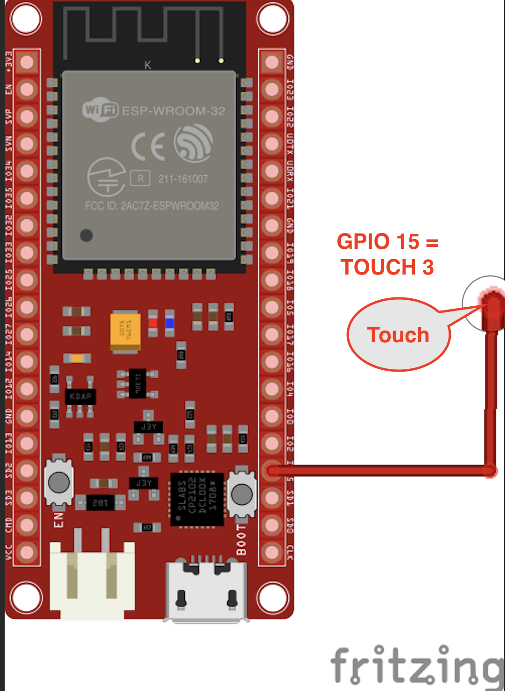

## *ESP32 Deep Sleep and Wake Up Sources*

We are using Olimex [ESP32-DevKit-LiPo Board](https://github.com/OLIMEX/ESP32-DevKit-LiPo/blob/master/DOCS/ESP32-DevKit-LiPo-user-manual.pdf) 

## Schematic and connections

- Pinout of the ESP32 board is shown [here](images/olimex_esp32.png).

- Schematic is [here](images/schematic_stepper.png).

- We'll connect a m/f wire to _GPIO15_




## Code to Run (Arduino Sketches)

1. Run this sketch in Arduino IDE, compile it and and upload it to the board. The stepper will start to rotate slowly to make 1024 steps per revolution with 5 revolutions per minite.

```cpp
/*
Deep Sleep with Touch Wake Up
=====================================
This code displays how to use deep sleep with
a touch as a wake up source and how to store data in
RTC memory to use it over reboots

ESP32 can have multiple touch pads enabled as wakeup source
ESP32-S2 and ESP32-S3 supports only 1 touch pad as wakeup source enabled

This code is under Public Domain License.

Author:
Pranav Cherukupalli <cherukupallip@gmail.com>
*/

#if CONFIG_IDF_TARGET_ESP32
#define THRESHOLD 40 /* Greater the value, more the sensitivity */
#elif (CONFIG_IDF_TARGET_ESP32S2 || CONFIG_IDF_TARGET_ESP32S3)
#define THRESHOLD 5000 /* Lower the value, more the sensitivity */
#else                  // ESP32-P4 + default for other chips (to be adjusted) */
#define THRESHOLD 500  /* Lower the value, more the sensitivity */
#endif

RTC_DATA_ATTR int bootCount = 0;
touch_pad_t touchPin;
/*
Method to print the reason by which ESP32
has been awaken from sleep
*/
void print_wakeup_reason() {
  esp_sleep_wakeup_cause_t wakeup_reason;

  wakeup_reason = esp_sleep_get_wakeup_cause();

  switch (wakeup_reason) {
    case ESP_SLEEP_WAKEUP_EXT0:     Serial.println("Wakeup caused by external signal using RTC_IO"); break;
    case ESP_SLEEP_WAKEUP_EXT1:     Serial.println("Wakeup caused by external signal using RTC_CNTL"); break;
    case ESP_SLEEP_WAKEUP_TIMER:    Serial.println("Wakeup caused by timer"); break;
    case ESP_SLEEP_WAKEUP_TOUCHPAD: Serial.println("Wakeup caused by touchpad"); break;
    case ESP_SLEEP_WAKEUP_ULP:      Serial.println("Wakeup caused by ULP program"); break;
    default:                        Serial.printf("Wakeup was not caused by deep sleep: %d\n", wakeup_reason); break;
  }
}

/*
Method to print the touchpad by which ESP32
has been awaken from sleep
*/
void print_wakeup_touchpad() {
  touchPin = esp_sleep_get_touchpad_wakeup_status();

#if CONFIG_IDF_TARGET_ESP32
  switch (touchPin) {
    case 0:  Serial.println("Touch detected on GPIO 4"); break;
    case 1:  Serial.println("Touch detected on GPIO 0"); break;
    case 2:  Serial.println("Touch detected on GPIO 2"); break;
    case 3:  Serial.println("Touch detected on GPIO 15"); break;
    case 4:  Serial.println("Touch detected on GPIO 13"); break;
    case 5:  Serial.println("Touch detected on GPIO 12"); break;
    case 6:  Serial.println("Touch detected on GPIO 14"); break;
    case 7:  Serial.println("Touch detected on GPIO 27"); break;
    case 8:  Serial.println("Touch detected on GPIO 33"); break;
    case 9:  Serial.println("Touch detected on GPIO 32"); break;
    default: Serial.println("Wakeup not by touchpad"); break;
  }
#else
  if (touchPin < TOUCH_PAD_MAX) {
    Serial.printf("Touch detected on GPIO %d\n", touchPin);
  } else {
    Serial.println("Wakeup not by touchpad");
  }
#endif
}

void setup() {
  Serial.begin(115200);
  delay(1000);  //Take some time to open up the Serial Monitor

  //Increment boot number and print it every reboot
  ++bootCount;
  Serial.println("Boot number: " + String(bootCount));

  //Print the wakeup reason for ESP32 and touchpad too
  print_wakeup_reason();
  print_wakeup_touchpad();

#if CONFIG_IDF_TARGET_ESP32
  //Setup sleep wakeup on Touch Pad 3 + 7 (GPIO15 + GPIO 27)
  touchSleepWakeUpEnable(T3, THRESHOLD);
  touchSleepWakeUpEnable(T7, THRESHOLD);

#else  //ESP32-S2 + ESP32-S3 + ESP32-P4
  //Setup sleep wakeup on Touch Pad 3 (GPIO3)
  touchSleepWakeUpEnable(T3, THRESHOLD);

#endif

  //Go to sleep now
  Serial.println("Going to sleep now");
  esp_deep_sleep_start();
  Serial.println("This will never be printed");
}

void loop() {
  //This will never be reached
}

```
