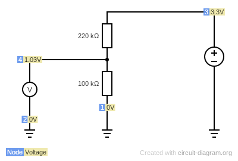

# Exercises

## Measure battery voltage

### Measuring analog voltages with ESP
Battery voltage cannot be measured on a digital pin, because it is an analog value that must be converted to digital first. Luckily, [ESP8266](https://www.espressif.com/sites/default/files/documentation/0a-esp8266ex_datasheet_en.pdf) and [ESP32](https://docs.espressif.com/projects/esp-idf/en/latest/api-reference/peripherals/adc.html) both have a built in ADC (analog to digital converter). 

This exercise can be done with both **ESP8266** and **ESP32**, but you must be aware of the differences.
- **ESP8266** - the chip itself expects a voltage within the range [0,1V], however there is usually a voltage divider on the board (Wemos D1 and NodeMCU), that allows us to pass higher voltages. For example, Wemos D1 has a 1/3.3 divider, that allows us to pass voltages in the range [0,3.3V]

> [**THE ABSOLUTE MAX TOLERABLE VOLTAGE ON THE RAW ANALOG PIN IS NO MORE THAN 1.8V**](https://www.esp8266.com/viewtopic.php?f=5&t=5556). Applying more will damage the board. Due to this, we may be forgiven if we pass e.g. 5V to the **input of the built in divider**. However, in all cases whe shall aim to have less than 1V on the internal analog pin. 

- **ESP32** - the chip has 2 ADCs that can be assigned to different pins. There is also a built in attenuator
[This video](https://www.youtube.com/watch?v=RlKMJknsNpo) has some useful clarifications on the ESP32 ADC peculiarities.

### Voltage dividers
If you need to measure higher voltages, you have to use e.g. a voltage divider to bring down the voltage to the allowed values.

> [Live divider](https://crcit.net/c/9a0ef05f)

This however may be in conflict with the board's built in divider and as a result you may get wrong values. Always check the cirquit diagram of the board before you design a divider cirquit and then use a cirquit simulator (e.g. [QUCS](http://qucs.sourceforge.net/)) to simulate it and double check that you don't exceed the voltages and that your assumptions are correct. 

### Measuring Vcc supply voltage
The ESP8266 ADC can be configured to [measure the Vcc supply voltate](https://arduino-esp8266.readthedocs.io/en/latest/reference.html#analog-input)

## OTA update
use `Sketch > Export Compiled Binary` menu item to obtain the `bin` file. More details in [this tutorial](https://randomnerdtutorials.com/bin-binary-files-sketch-arduino-ide/).

### ESP8266
* [Local HTTP server + browser update](https://github.com/esp8266/Arduino/tree/2.3.0/doc/ota_updates#web-browser) - 
* [Remote HTTP server update](https://github.com/esp8266/Arduino/tree/2.3.0/doc/ota_updates#http-server) - use a local XAMPP server and get the PHP example running and adapted to your use case.

### ESP32
Use the [official ESP32 library for OTA](https://github.com/espressif/arduino-esp32/tree/master/libraries/Update). They also have an useful [example how to update from S3](https://github.com/espressif/arduino-esp32/blob/master/libraries/Update/examples/AWS_S3_OTA_Update/AWS_S3_OTA_Update.ino).

## Onboarding
Implement onboarding with WifiManager. There are different libraries, some of which work only on ESP8266.
* [ESP8266 WiFiManager](https://github.com/tzapu/WiFiManager)
* [ESP32&ESP8266 WifiManager](https://github.com/zhouhan0126/WIFIMANAGER-ESP32) 
* [ESP32 only](https://github.com/tonyp7/esp32-wifi-manager)
* [IotWebConf](https://github.com/prampec/IotWebConf)

Goals:
  * Use shall be able to enter WiFi credentials of a brand new device
  * When the wifi connection is lost, user shall be able to re-enter credentials or connect to a different network

## Detect unexpected restarts (e.g. WDT)
### ESP8266
* Use the ESP8266 SDK to read the [reason for reset](https://www.espressif.com/sites/default/files/documentation/esp8266_reset_causes_and_common_fatal_exception_causes_en.pdf).
* Look around for other interesting information [in the API](https://github.com/esp8266/Arduino/blob/61cd8d83859524db0066a647de3de3f6a0039bb2/libraries/esp8266/examples/TestEspApi/TestEspApi.ino)

### ESP32
Take a look at the [official example for reset reason](https://github.com/espressif/arduino-esp32/blob/master/libraries/ESP32/examples/ResetReason/ResetReason.ino). Take into account that there are two CPUs in ESP32.

# References
* [Resistor color codes](https://www.digikey.com/en/resources/conversion-calculators/conversion-calculator-resistor-color-code-5-band)
* [Arduino timekeeping](http://www.instructables.com/id/TESTED-Timekeeping-on-ESP8266-Arduino-Uno-WITHOUT-/)
* [Hotspot manager for Android](https://play.google.com/store/apps/details?id=com.etustudio.android.hotspotmanager&hl=en)
* [Multicast DNS](https://en.wikipedia.org/wiki/Multicast_DNS)
* [DNS-SD](http://www.dns-sd.org/)

# Extra
* [ESPHome & HomeAssistant for home automation](https://esphome.io/guides/getting_started_hassio.html)
